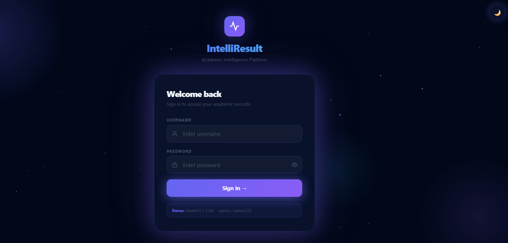
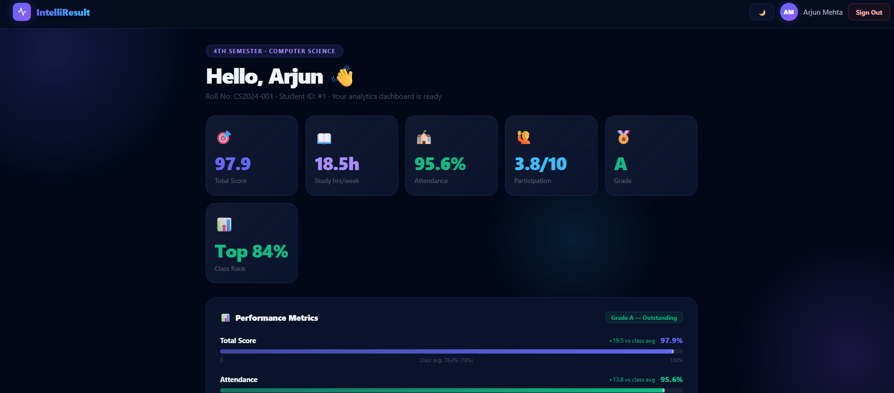
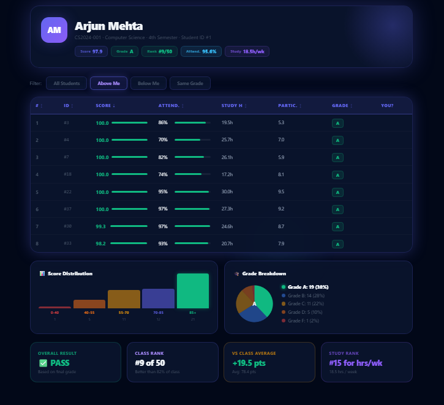

<div align="center">

# 🎓 IntelliResult

### AI-Powered Student Performance Analytics Dashboard

A modern and responsive web application that transforms student academic records into meaningful insights through interactive dashboards, visual analytics, and personalized performance tracking.

<p>


</p>

</div>

---

# 📖 Overview

**IntelliResult** is a frontend-based academic analytics dashboard built to help students understand their academic performance beyond traditional mark sheets.

The application presents attendance, grades, study statistics, and performance trends through a clean, modern interface that makes educational data easier to interpret and act upon.

---

# ✨ Application Preview

<div align="center">

| 🔐 Login | 📊 Dashboard | 📈 Analytics |
|:--------:|:------------:|:------------:|
|  |  |  |

</div>

---

# 🚀 Features

### 📊 Academic Analytics

- Subject-wise Performance Analysis
- Overall Percentage Calculation
- Grade Visualization
- Attendance Monitoring
- Study Progress Tracking

### 🎯 Student Dashboard

- Secure Login
- Personalized Dashboard
- Performance Summary
- Interactive Insights
- Responsive Interface

### 🎨 User Experience

- Clean & Modern Design
- Mobile Responsive
- Smooth Navigation
- Fast Loading
- Interactive Components

---

# 🛠️ Tech Stack

| Technology | Purpose |
|------------|---------|
| HTML5 | Structure |
| CSS3 | Styling & Responsive Design |
| JavaScript (ES6) | Functionality & Interactivity |
| Git & GitHub | Version Control |
| GitHub Pages | Deployment |

---

# 📂 Project Structure

```text
IntelliResult/
│
├── assets/
│   ├── login.png
│   ├── dashboard.png
│   └── analysis.png
│
├── index.html
├── dashboard.html
├── result.html
├── data.js
├── student_performance.csv
└── README.md
```

---

# 🌟 Project Highlights

| Feature | Status |
|----------|:------:|
| Secure Login | ✅ |
| Interactive Dashboard | ✅ |
| Academic Analytics | ✅ |
| Attendance Tracking | ✅ |
| Responsive Design | ✅ |
| Performance Visualization | ✅ |

---

# 💡 Skills Demonstrated

- Frontend Development
- Responsive Web Design
- UI/UX Design
- JavaScript Programming
- Dashboard Development
- Data Visualization
- Git & GitHub
- Problem Solving

---

# 🚀 Getting Started

### Clone the repository

```bash
git clone https://github.com/Madiha-14/IntelliResult.git
```

### Navigate to the project

```bash
cd IntelliResult
```

### Run the project

Simply open:

```text
index.html
```

in your preferred web browser.

---

# 🌐 Live Demo

🔗 **https://madiha-14.github.io/IntelliResult/**

---

# 🔮 Future Enhancements

- 🤖 AI-based Performance Prediction
- 📄 PDF Report Generation
- ☁ Cloud Database Integration
- 👨‍🏫 Faculty Dashboard
- 👩‍💼 Admin Portal
- 🔐 Backend Authentication
- 📱 Progressive Web App (PWA)

---

# 👩‍💻 Developer

<div align="center">

## Madiha 

**B.Tech – Computer Science & Engineering (Data Science)**

Passionate about building intelligent, user-centric applications using **Data Science**, **Machine Learning**, and **Modern Web Technologies**.

</div>

---

<div align="center">

### ⭐ If you found this project interesting, consider giving it a Star!

</div>
